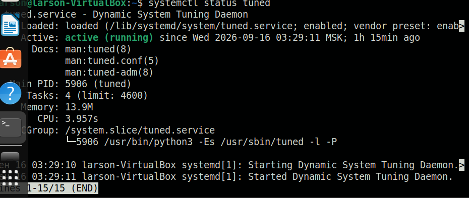
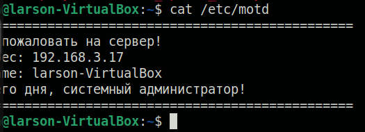
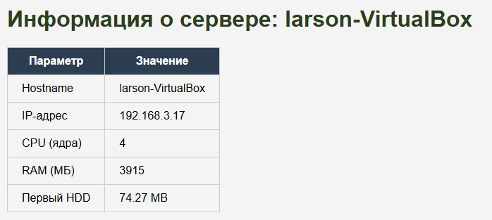

# Домашнее задание к занятию "`Ansible. Часть 2`" - `Ларионов Алексндр`


### Инструкция по выполнению домашнего задания

   1. Сделайте `fork` данного репозитория к себе в Github и переименуйте его по названию или номеру занятия, например, https://github.com/имя-вашего-репозитория/git-hw или  https://github.com/имя-вашего-репозитория/7-1-ansible-hw).
   2. Выполните клонирование данного репозитория к себе на ПК с помощью команды `git clone`.
   3. Выполните домашнее задание и заполните у себя локально этот файл README.md:
      - впишите вверху название занятия и вашу фамилию и имя
      - в каждом задании добавьте решение в требуемом виде (текст/код/скриншоты/ссылка)
      - для корректного добавления скриншотов воспользуйтесь [инструкцией "Как вставить скриншот в шаблон с решением](https://github.com/netology-code/sys-pattern-homework/blob/main/screen-instruction.md)
      - при оформлении используйте возможности языка разметки md (коротко об этом можно посмотреть в [инструкции  по MarkDown](https://github.com/netology-code/sys-pattern-homework/blob/main/md-instruction.md))
   4. После завершения работы над домашним заданием сделайте коммит (`git commit -m "comment"`) и отправьте его на Github (`git push origin`);
   5. В личном кабинете прикрепите и отправьте ссылку на решение в виде md-файла в вашем Github.
   6. Любые вопросы по выполнению заданий спрашивайте в разделе “Вопросы по заданию” в личном кабинете.
   
Желаем успехов в выполнении домашнего задания!
   
### Дополнительные материалы, которые могут быть полезны для выполнения задания

1. [Руководство по оформлению Markdown файлов](https://gist.github.com/Jekins/2bf2d0638163f1294637#Code)

---
## Задание 1. Три плейбука

В этом задании написаны три плейбука Ansible:

1. Скачивает архив Apache Kafka, создаёт папку для распаковки и распаковывает архив.
2. Устанавливает пакет `tuned` из стандартного репозитория, запускает его как демон и добавляет в автозагрузку.
3. Изменяет приветствие системы (`/etc/motd`) через переменную.

При написании использовались только идемпотентные модули Ansible. Модули `shell` и `command` не применялись.

---

### 1.1. Скачивание и распаковка архива

**Что делает плейбук:**

- создаёт директорию `/opt/kafka` для распаковки;
- скачивает архив Apache Kafka по URL;
- распаковывает архив в созданную директорию.

**Файл `task1_download.yml`:**

```yaml
---
- name: Download and unpack Kafka archive
  hosts: web
  become: true

  vars:
    archive_url: "https://downloads.apache.org/kafka/3.7.0/kafka_2.13-3.7.0.tgz"
    archive_dest: "/tmp/kafka_2.13-3.7.0.tgz"
    extract_dir: "/opt/kafka"

  tasks:
    - name: Create directory for extraction
      ansible.builtin.file:
        path: "{{ extract_dir }}"
        state: directory
        mode: "0755"

    - name: Download archive
      ansible.builtin.get_url:
        url: "{{ archive_url }}"
        dest: "{{ archive_dest }}"
        mode: "0644"
        timeout: 120

    - name: Unpack archive
      ansible.builtin.unarchive:
        src: "{{ archive_dest }}"
        dest: "{{ extract_dir }}"
        remote_src: true
        extra_opts: [--strip-components=1]
```

**Вывод выполнения:**

```text
TASK [Create directory for extraction] ***
changed: [ubuntu-vm]

TASK [Download archive] ***
changed: [ubuntu-vm]

TASK [Unpack archive] ***
changed: [ubuntu-vm]

PLAY RECAP ***
ubuntu-vm : ok=4 changed=3 unreachable=0 failed=0 ...
```

**Скриншот результата (`ls /opt/kafka` в Ubuntu VM):**


---

### 1.2. Установка и запуск tuned

**Что делает плейбук:**

- устанавливает пакет `tuned` из стандартного репозитория;
- запускает `tuned` как демон;
- добавляет `tuned` в автозагрузку.

**Файл `task2_tuned.yml`:**

```yaml
---
- name: Install and enable tuned
  hosts: web
  become: true

  tasks:
    - name: Install tuned
      ansible.builtin.apt:
        name: tuned
        state: present
        update_cache: true

    - name: Ensure tuned is running and enabled
      ansible.builtin.systemd:
        name: tuned
        state: started
        enabled: true
```

**Вывод выполнения:**

```text
TASK [Install tuned] ***
changed: [ubuntu-vm]

TASK [Ensure tuned is running and enabled] ***
changed: [ubuntu-vm]

PLAY RECAP ***
ubuntu-vm : ok=3 changed=2 unreachable=0 failed=0 ...
```

**Скриншот `systemctl status tuned`:**



---

### 1.3. Изменение motd

**Что делает плейбук:**

- записывает в `/etc/motd` приветствие, заданное через переменную `greeting`.

**Файл `task3_motd.yml`:**

```yaml
---
- name: Change motd greeting
  hosts: web
  become: true

  vars:
    greeting: "Welcome to my Ansible-managed server!"

  tasks:
    - name: Write custom motd
      ansible.builtin.copy:
        content: "{{ greeting }}\n"
        dest: /etc/motd
        mode: "0644"
```

**Вывод выполнения:**

```text
TASK [Write custom motd] ***
changed: [ubuntu-vm]

PLAY RECAP ***
ubuntu-vm : ok=2 changed=1 unreachable=0 failed=0 ...
```

**Скриншот `cat /etc/motd`:**



---

## Задание 2. Модифицированный motd

**Что делает плейбук:**

- записывает в `/etc/motd` IP-адрес и hostname управляемого хоста;
- добавляет пожелание хорошего дня системному администратору;
- использует Ansible facts для получения IP и hostname.

**Файл `task2_motd_advanced.yml`:**

```yaml
---
- name: Advanced motd with facts
  hosts: web
  become: true

  tasks:
    - name: Write dynamic motd
      ansible.builtin.copy:
        dest: /etc/motd
        mode: "0644"
        content: |
          ====================================================
          Добро пожаловать на сервер!
          IP-адрес: {{ ansible_default_ipv4.address }}
          Hostname: {{ ansible_hostname }}
          Хорошего дня, системный администратор!
          ====================================================
```

**Вывод выполнения:**

```text
TASK [Write dynamic motd] ***
changed: [ubuntu-vm]

PLAY RECAP ***
ubuntu-vm : ok=2 changed=1 unreachable=0 failed=0 ...
```

**Скриншот `cat /etc/motd`:**


---

## Задание 3. Роль Apache

**Что делает роль:**

- устанавливает веб-сервер Apache на управляемый хост;
- конфигурирует `index.html` с выводом характеристик компьютера (CPU, RAM, величина первого HDD, IP-адрес) через Ansible facts и Jinja2-шаблон;
- открывает порт 80, если необходимо;
- запускает Apache и добавляет его в автозагрузку;
- проверяет доступность сайта (ответ 200) через модуль `uri`;
- использует handler: перезапуск Apache только в случае изменения файла конфигурации Apache.

### Структура роли

```text
roles/apache_web/
├── defaults/main.yml
├── handlers/main.yml
├── tasks/main.yml
└── templates/index.html.j2
```

### Файлы роли

`roles/apache_web/tasks/main.yml`:

```yaml
---
- name: Install Apache
  ansible.builtin.apt:
    name: apache2
    state: present
    update_cache: true

- name: Deploy index.html from template
  ansible.builtin.template:
    src: index.html.j2
    dest: /var/www/html/index.html
    mode: "0644"
  notify: Restart apache

- name: Ensure port 80 is open (ufw)
  ansible.builtin.ufw:
    rule: allow
    port: "80"
    proto: tcp
  when: ansible_facts.packages is defined and 'ufw' in ansible_facts.packages

- name: Ensure Apache is running and enabled
  ansible.builtin.systemd:
    name: apache2
    state: started
    enabled: true

- name: Check website availability
  ansible.builtin.uri:
    url: "http://{{ ansible_default_ipv4.address }}/"
    status_code: 200
  delegate_to: localhost
  become: false
```

`roles/apache_web/handlers/main.yml`:

```yaml
---
- name: Restart apache
  ansible.builtin.systemd:
    name: apache2
    state: restarted
```

`roles/apache_web/templates/index.html.j2`:

```html
<!DOCTYPE html>
<html lang="ru">
<head>
    <meta charset="utf-8">
    <title>Server Info — {{ ansible_hostname }}</title>
</head>
<body>
    <h1>Информация о сервере: {{ ansible_hostname }}</h1>
    <table border="1">
        <tr><th>Параметр</th><th>Значение</th></tr>
        <tr><td>Hostname</td><td>{{ ansible_hostname }}</td></tr>
        <tr><td>IP-адрес</td><td>{{ ansible_default_ipv4.address }}</td></tr>
        <tr><td>CPU (ядра)</td><td>{{ ansible_processor_vcpus }}</td></tr>
        <tr><td>RAM (МБ)</td><td>{{ ansible_memtotal_mb }}</td></tr>
        <tr><td>Первый HDD</td><td>{{ ansible_devices[ansible_devices.keys() | list | first].size | default('N/A') }}</td></tr>
    </table>
</body>
</html>
```

`task3_apache_role.yml`:

```yaml
---
- name: Configure web server with role
  hosts: web
  become: true

  roles:
    - apache_web
```

### Вывод выполнения

```text
TASK [apache_web : Install Apache] ***
changed: [ubuntu-vm]

TASK [apache_web : Deploy index.html from template] ***
changed: [ubuntu-vm]

TASK [apache_web : Ensure Apache is running and enabled] ***
changed: [ubuntu-vm]

TASK [apache_web : Check website availability] ***
ok: [localhost]

RUNNING HANDLER [apache_web : Restart apache] ***
changed: [ubuntu-vm]

PLAY RECAP ***
ubuntu-vm : ok=5 changed=3 unreachable=0 failed=0 ...
```

**Скриншот веб-страницы:**



### Проверка работы handler

Handler перезапускает Apache **только** если шаблон `index.html.j2` изменился. Проверяем двумя запусками.

**Первый запуск (шаблон изменился):**

```text
TASK [apache_web : Deploy index.html from template] ***
changed: [ubuntu-vm]

RUNNING HANDLER [apache_web : Restart apache] ***
changed: [ubuntu-vm]
```

**Повторный запуск без изменений:**

```text
TASK [apache_web : Deploy index.html from template] ***
ok: [ubuntu-vm]

PLAY RECAP ***
ubuntu-vm : ok=5 changed=0 unreachable=0 failed=0 ...
```

Handler не срабатывает — значит, он настроен правильно.

---

## Используемые модули

В работе использованы только идемпотентные модули Ansible. Модули `shell` и `command` не применялись, согласно требованию задания:

- `ansible.builtin.file` — создание директорий;
- `ansible.builtin.get_url` — скачивание архива;
- `ansible.builtin.unarchive` — распаковка архива;
- `ansible.builtin.apt` — установка пакетов;
- `ansible.builtin.systemd` — управление сервисами;
- `ansible.builtin.copy` — запись motd;
- `ansible.builtin.template` — рендер Jinja2-шаблона;
- `ansible.builtin.ufw` — открытие порта;
- `ansible.builtin.uri` — проверка доступности сайта.
